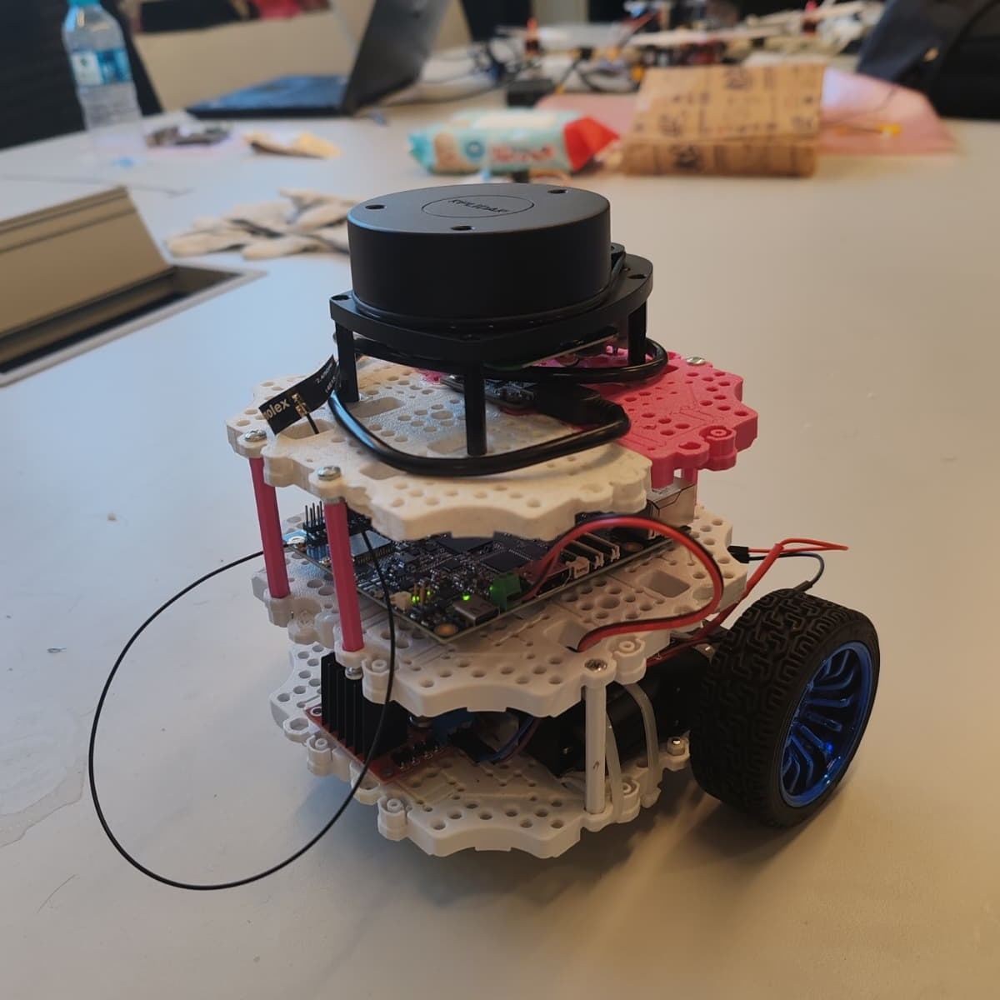
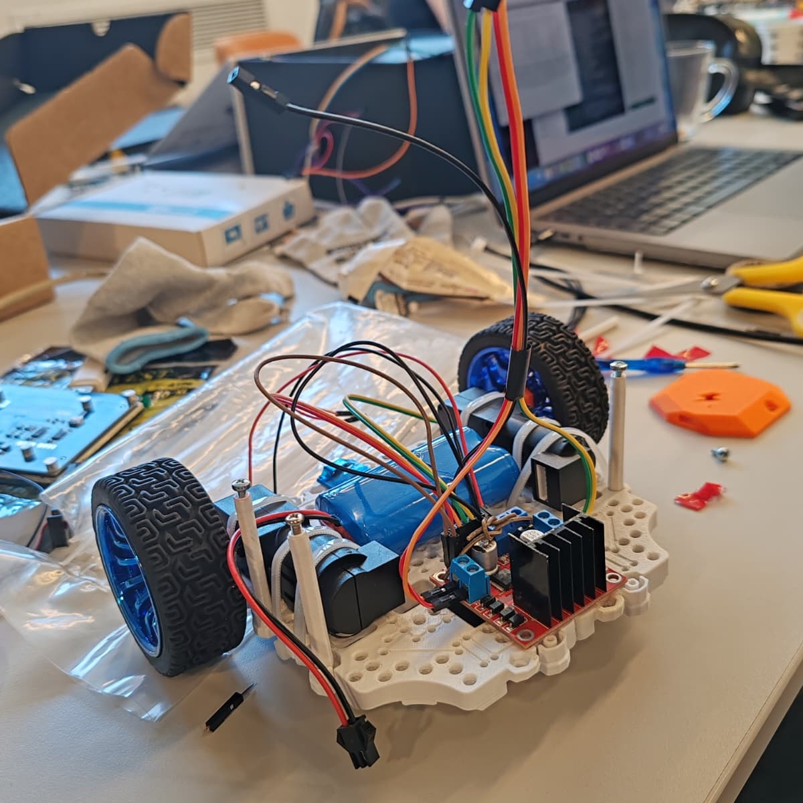
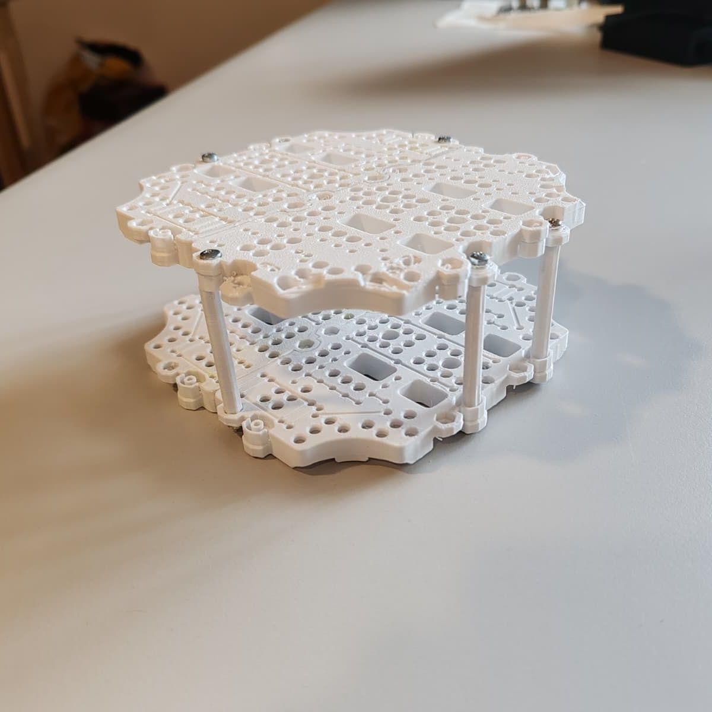

    <picture>
        <source media="(prefers-color-scheme: dark)" srcset="https://raw.githubusercontent.com/t3gemstone/docs/main/logo/dark.png" width="40%" />
        <source media="(prefers-color-scheme: light)" srcset="https://raw.githubusercontent.com/t3gemstone/docs/main/logo/light.png" width="40%" />
        
    </picture>

# T3 Gemstone Bumin IKA

  
  
  
  
  

> **[TR]** T3 Gemstone O1 üzerinde çalışan, sensörler ve motor akışlarını tek bir ROS 2 bringup hattında toplayan diferansiyel sürüşlü İKA projesi.
>
> **[EN]** A differential-drive UGV project running on the T3 Gemstone O1, bringing sensors and motor workflows together in a single ROS 2 bringup flow.

  
  
  

## Kısa Tanım

Bu repo ana uygulama kodunu ve kısa çalışma notlarını içerir. Ayrıntılı dokümantasyon için doğrudan kaynak dosyalara geçin:

- [Türkçe dokümanlar](https://github.com/alitalhq/t3gemstone-bumin-ika-docs/tree/main/docs/tr)
- [English docs](https://github.com/alitalhq/t3gemstone-bumin-ika-docs/tree/main/docs/en)
- [Docs repo README](https://github.com/alitalhq/t3gemstone-bumin-ika-docs/blob/main/README.md)

Tek kart yaklaşımı kullanılır. IMU, motor sürücü, ultrasonik sensörler, lidar ve kamera Linux tarafındaki ROS 2 node'ları ile çalışır.

## Neler Var?

- `src/` - ROS 2 paketleri
- `hardware/` - kısa donanım notları
- `tools/` - yardımcı araçlar için kısa alan
- `docs/llms.txt` - docs reposundaki içerik haritası

## Durum

| Alan | Durum |
|---|---|
| Bringup | Tek launch ile çalışıyor |
| Dokümantasyon | Ayrıntılı içerik docs reposunda |
| Dil desteği | TR / EN girişleri mevcut |

## Devam

- [Dokümantasyon Girişi](https://github.com/alitalhq/t3gemstone-bumin-ika-docs/tree/main/docs/tr/01-kart-kurulumu.md)
- [English Documentation](https://github.com/alitalhq/t3gemstone-bumin-ika-docs/tree/main/docs/en/01-board-setup.md)
