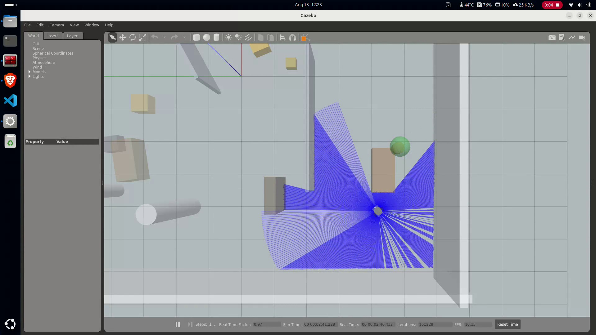
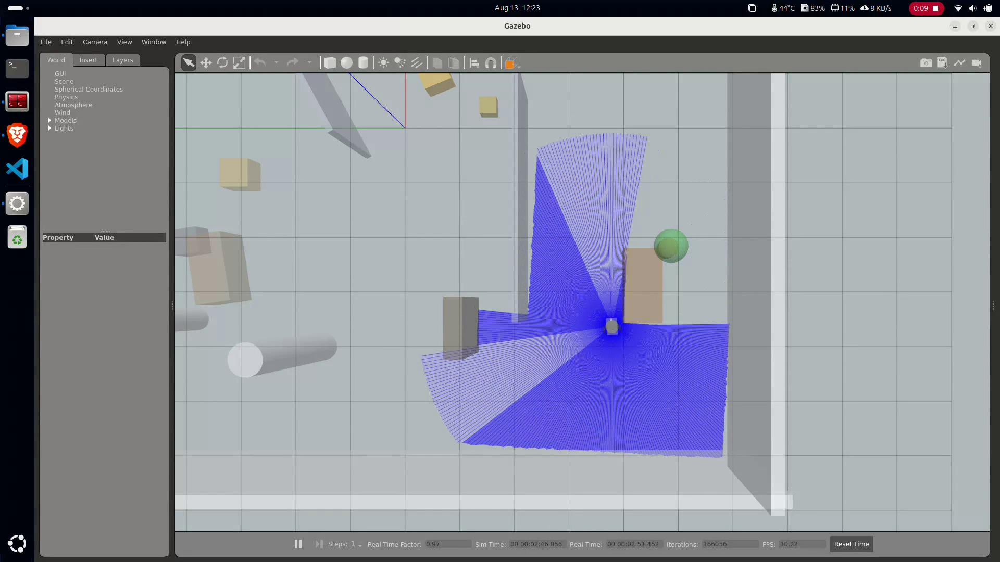
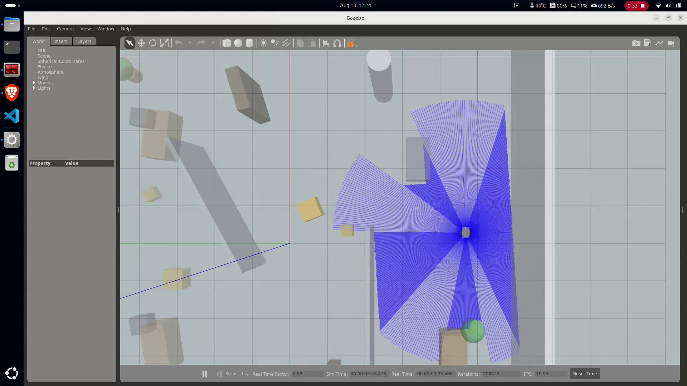

<p align="center">
    <picture>
        <source media="(prefers-color-scheme: dark)" srcset="https://raw.githubusercontent.com/t3gemstone/docs/main/logo/dark.png" width="40%" />
        <source media="(prefers-color-scheme: light)" srcset="https://raw.githubusercontent.com/t3gemstone/docs/main/logo/light.png" width="40%" />
        
    </picture>
</p>

# T3 Gemstone Bumin IKA

<p align="center">
  <a href="https://t3gemstone.org"></a>
  <a href="https://opensource.org/licenses/Apache-2.0"></a>
  <a href="https://github.com/alitalhq/t3gemstone-bumin-ika-docs"></a>
  <a href="https://github.com/alitalhq/t3gemstone-bumin-ika-docs/tree/main/docs/tr/01-kart-kurulumu.md"></a>
  <a href="https://github.com/alitalhq/t3gemstone-bumin-ika-docs/tree/main/docs/en/01-board-setup.md"></a>
</p>

> **[TR]** T3 Gemstone O1 üzerinde çalışan, sensörler ve motor akışlarını tek bir ROS 2 bringup hattında toplayan diferansiyel sürüşlü İKA projesi.
>
> **[EN]** A differential-drive UGV project running on the T3 Gemstone O1, bringing sensors and motor workflows together in a single ROS 2 bringup flow.

<p align="center">
  
  
  
</p>

## Kısa Tanım

Bu repo ana uygulama kodunu ve kısa çalışma notlarını içerir. Ayrıntılı dokümantasyon için doğrudan kaynak dosyalara geçin:

- [Türkçe dokümanlar](https://github.com/alitalhq/t3gemstone-bumin-ika-docs/tree/main/docs/tr)
- [English docs](https://github.com/alitalhq/t3gemstone-bumin-ika-docs/tree/main/docs/en)
- [Docs repo README](https://github.com/alitalhq/t3gemstone-bumin-ika-docs/blob/main/README.md)

Tek kart yaklaşımı kullanılır. IMU, motor sürücü, ultrasonik sensörler, lidar ve kamera Linux tarafındaki ROS 2 node'ları ile çalışır.

## Neler Var?

- `src/` - ROS 2 paketleri
- `src/gemstone_sim/` - Gazebo Classic ofis simülasyonu
- `assets/sim/` - simülasyon görselleri
- `hardware/` - kısa donanım notları
- `tools/` - yardımcı araçlar için kısa alan
- `docs/tr/simulasyon.md` - simülasyonu çalıştırma notları
- `docs/llms.txt` - docs reposundaki içerik haritası

## Simülasyon (Gazebo)

Donanım olmadan üst katman node'larını test etmek için `gemstone_sim`
paketi, Gazebo Classic içinde özel bir **ofis dünyası** kullanır. Gerçek
donanım katmanlarının yerini `gazebo_ros` plugin'leri alır; `motion_state`,
`exploration_demo`, `obstacle_avoidance` ve `image_processing` node'ları
aynı topic isimleriyle olduğu gibi çalışır.

Kurulum ve çalıştırma için [docs/tr/simulasyon.md](docs/tr/simulasyon.md)
ve docs reposundaki
[13-simulasyon](https://github.com/alitalhq/t3gemstone-bumin-ika-docs/blob/main/docs/tr/13-simulasyon.md)
sayfasına bakın:

```bash
cd /ros_ws && source /opt/ros/humble/setup.bash
colcon build --symlink-install \
  --packages-select gemstone_sim gemstone_frontier_explorer \
  gemstone_lidar_bringup gemstone_obstacle_avoidance
source install/setup.bash
ros2 launch gemstone_sim sim_bringup.launch.py
```

> Not: `sim_bringup`'ın RViz default config'i `gemstone_frontier_explorer`
> paketinden geldiği ve obstacle/lidar paketlerini başlattığı için tek paket
> yerine yukarıdaki set build edilir.

## Otonom Haritalama (auto_mapping)

Ev dünyasında (`house.world`) tam otonom kesif ve harita çıkarma için
`gemstone_frontier_explorer` paketi kullanılır: Gazebo + slam_toolbox +
Nav2 + frontier keşfi tek launch'ta başlar, robot evi kendi kendine
dolaşır ve haritayı kaydeder.

```bash
ros2 launch gemstone_frontier_explorer auto_mapping.launch.py \
  world_file:=/ros_ws/install/gemstone_sim/share/gemstone_sim/worlds/house.world \
  enable_rviz:=true
```

Ayrıntılı akış (keşfe başlatma, izleme, harita kaydetme, video kaydı) için
[docs/tr/ev-haritalama.md](docs/tr/ev-haritalama.md) bölümüne bakın.

## GCS (Tarayıcıda Yer Kontrol İstasyonu)

Simülasyonu Gazebo + RViz yerine tarayıcıdan izleyip yönetmek için
`gemstone_gcs` paketi rosbridge + web_video_server + statik web arayüzünü
(`gcs/`) tek launch'ta başlatır: harita, kamera akışı, teleop ve keşif
kontrolü `http://localhost:8000` üzerinden çalışır.

```bash
colcon build --symlink-install --packages-select gemstone_gcs
ros2 launch gemstone_gcs gcs_bringup.launch.py
# tarayıcıda http://localhost:8000 aç, Bağlan'a bas
```

Ayrıntılar için [docs/tr/gcs.md](docs/tr/gcs.md) bölümüne bakın.

<video controls width="100%">
  <source src="https://raw.githubusercontent.com/alitalhq/t3gemstone-bumin-ika-docs/main/docs/assets/sim/sim-office-exploration.mp4" type="video/mp4">
  Tarayıcınız video etiketini desteklemiyor.
</video>

<p align="center">
  
  
  
</p>

## Durum

| Alan | Durum |
|---|---|
| Bringup | Tek launch ile çalışıyor |
| Simülasyon | Gazebo ofis dünyası + gemstone node'ları |
| Otonom haritalama | Ev dünyası + frontier keşfi (`auto_mapping`) |
| GCS | Tarayıcıdan harita + kamera + teleop + keşif (`gcs_bringup`) |
| Dokümantasyon | Ayrıntılı içerik docs reposunda |
| Dil desteği | TR / EN girişleri mevcut |

## Devam

- [Dokümantasyon Girişi](https://github.com/alitalhq/t3gemstone-bumin-ika-docs/tree/main/docs/tr/01-kart-kurulumu.md)
- [English Documentation](https://github.com/alitalhq/t3gemstone-bumin-ika-docs/tree/main/docs/en/01-board-setup.md)
